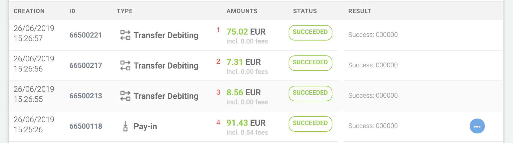

# How to test Third Party Delivery

To test third party delivery, you will need a product with `seller delivery` and `third party delivery`.

## Add a route

1. Log in as a seller.
2. Go to `Selling` -> `Routes` and create a new route.

## Buy a product

1. Log in as a buyer.
2. Find a product with third party delivery (example: [https://api.example.com/products/9](https://api.example.com/products/9)).
3. Buy it.
4. You should not receive any documents at this point.

## Claim a job

1. Log in as a seller.
2. Go to `Selling` -> `Available Jobs`.
3. Claim a job.
4. Go to [https://console.cloud.google.com/appengine/cronjobs?project=project-id](https://console.cloud.google.com/appengine/cronjobs?project=project-id) and run `Third party delivery orders` task.
   
5. You should receive all the documents.

## Payments

1. Log in to Mangopay Sandbox (https://dashboard.sandbox.mangopay.com)
2. Go to users and find the buyer user.
3. The wallet money balance should be 0.00 EUR. If the balance is higher than 0, click on the icon with three dots and create pay-out.
4. Go to events.
5. Find your event with `PayIn Created` type. (Usually the lastest one.)
6. Click `Sandbox Process`.
   
7. The entire operation takes ~1min.
8. Go to credited wallet details view.
   
9. We should have 4 operations with `SUCCEEDED` status.
   
10. Compare the values with values on the invoices. Pay-in is money from the buyer - this value should be on the buyer invoice. We should have one transfer for platform user (2), one transfer for the user who delivers goods (3) and one transfer for the seller.
11. Sum of values number 1, 2, 3 and 5 (see above) should be equal to the value with number 5.

### What should be verified

1. The seller who claimed the job should receive a delivery invoice.
2. Documents should contain the correct user/company wherever the delivery is mentioned.
3. If an order does not contain any product with third party delivery, documents should be sent automatically right after checkout.
4. When a job is claimed, no other user should be able to claim it again.
5. Every time when we create an order, jobs should be created for each seller who has defined routes.
6. When a seller adds a new route, we should create a job for every active order.
7. Try to compare route length and detour with results from Google Maps (it should be similar).
8. When a job is not claimed till 6PM, the product seller should be listed in delivery section in all documents.
9. All third party delivery documents are sent automatically every day at 6PM.
10. User should be able to unclaim a job till 6PM.
